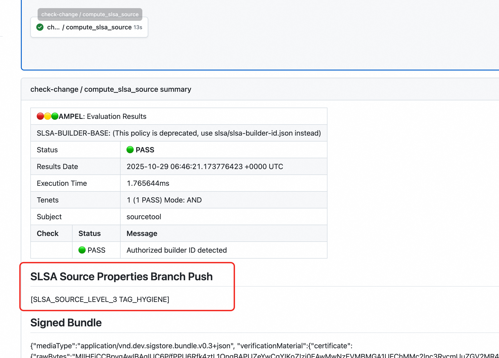
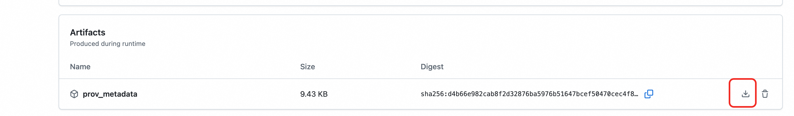
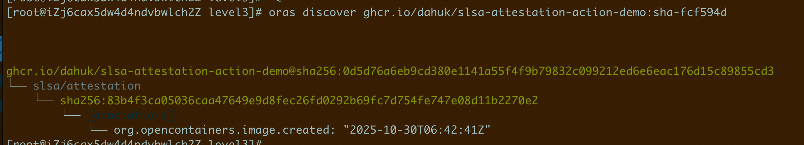
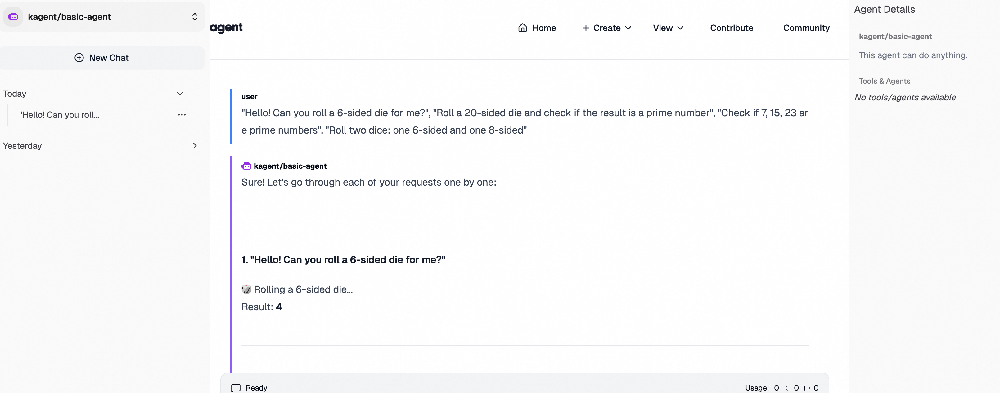

# QuickStart


## Environment setup:

1. Initialize a [Kind](https://kind.sigs.k8s.io/docs/user/quick-start/) cluster:
```bash
git clone https://github.com/auth0-samples/auth0-ai-samples.git
cd auth0-ai-samples/authenticate-users/langchain-fastapi-py
```

2. Install Gatekeeper:
```bash
helm install gatekeeper/gatekeeper  \
  --version 3.18.0 \
  --name-template=gatekeeper \
  --namespace kube-system --create-namespace \
  --set enableExternalData=true \
  --set validatingWebhookTimeoutSeconds=8 \
  --set mutatingWebhookTimeoutSeconds=2 \
  --set externaldataProviderResponseCacheTTL=10s 
```

3. Install Ratify following the [official docs](https://ratify.dev/docs/quickstarts/quickstart-manual/):

```bash
helm repo add ratify https://notaryproject.github.io/ratify
# download the notary verification certificate
curl -sSLO https://raw.githubusercontent.com/deislabs/ratify/main/test/testdata/notation.crt
helm install ratify \
    ratify/ratify --atomic \
    --namespace kube-system \
    --set-file notationCerts={./notation.crt} \
    --set featureFlags.RATIFY_CERT_ROTATION=true \
    --set policy.useRego=true
```

  **Until an official Ratify release includes [#2442](https://github.com/notaryproject/ratify/pull/2442/files), replace the image in the Ratify deployment with a [dev image]() that includes the SLSA verifier plugin.**

4. Install the oras CLI per the [docs](https://oras.land/docs/installation/).
5. Install kagent per the [docs](https://kagent.dev/docs/kagent/introduction/installation). In this demo, we will follow kagent's [BYO agent](https://kagent.dev/docs/kagent/examples/a2a-byo) approach to deploy to the cluster a trusted agent image that has passed SLSA Source Attestation verification.

6. Deploy a demo constraint

```bash
kubectl apply -f https://notaryproject.github.io/ratify/library/default/template.yaml

kubectl apply -f - <<EOF
apiVersion: constraints.gatekeeper.sh/v1beta1
kind: RatifyVerification
metadata:
  name: ratify-constraint
spec:
  enforcementAction: deny
  match:
    kinds:
    - apiGroups:
      - ""
      kinds:
      - Pod
    namespaces:
    - kagent
EOF

```


## Producing open-source code compliant with SLSA Source Level 3

[SLSA v1.2 RC1 Source Track](https://slsa.dev/spec/v1.2-rc1/source-requirements#basics) level definitions are as follows:

| Track/Level                                                  | Requirements                                       | Focus                                                     |
| ------------------------------------------------------------ | -------------------------------------------------- | --------------------------------------------------------- |
| [Source L1](https://slsa.dev/spec/v1.2-rc1/source-requirements#source-l1) | Use a version control system                       | First steps towards operational maturity                  |
| [Source L2](https://slsa.dev/spec/v1.2-rc1/source-requirements#source-l2) | History and controls for protected branches & tags | Preserve history and ensure the process has been followed |
| [Source L3](https://slsa.dev/spec/v1.2-rc1/source-requirements#source-l3) | Signed provenance                                  | Tampering by the source control system                    |
| [Source L4](https://slsa.dev/spec/v1.2-rc1/source-requirements#source-l4) | Code review                                        | Tampering by project contributors                         |

For a GitHub project, you can use [source-actions](https://github.com/slsa-framework/source-actions) in GitHub workflows to automate [source-tool](https://github.com/slsa-framework/source-tool) for evaluating the SLSA Source Track and signing/uploading the VSA/provenance metadata. The [requirement items](https://github.com/slsa-framework/source-tool/blob/main/docs/REQUIREMENTS_MAPPING.md) for each level are explicitly defined in source-tool.

You can refer to this sample [slsa.yml](https://github.com/DahuK/slsa-attestation-action-demo/blob/main/.github/workflows/slsa.yml).

After configuring the pipeline, when a commit is merged into the main branch, source-tool will automatically validate the SLSA level and sign the VSA/provenance using DSSE envelop with Cosign.

To meet SLSA Source Level 3 requirements, project administrators must ensure technical controls for branches and all tags. [DESIGN.md](https://github.com/slsa-framework/source-tool/blob/main/docs/DESIGN.md) outlines several controls such as `CONTINUITY_ENFORCED`, `REVIEW_ENFORCED`, `TAG_HYGIENE`, and custom `GH_REQUIRED_CHECK_*` controls that map to organization-defined checks. You can refer to the demo project's [rulesets](https://github.com/DahuK/slsa-attestation-action-demo/settings/rules) as an example.

Submit a commit to trigger the job. After it succeeds, you can view the branch's SLSA Source Level after the commit in the corresponding job run on the Actions page:




Click to download prov_metadata:




## Attach SLSA Attestation to Image 

Unzip the downloaded prov_metadata artifacts; you'll see a `signed_bundle.intoto.jsonl` that conforms to the in-toto Attestation specification. To verify Ratify's handling of SLSA attestations, use the oras CLI to attach the [level 1](https://github.com/DahuK/slsa-attestation-action-demo/actions/runs/18866044575) and level 3 `signed_bundle.intoto.jsonl` files to the demo image. Commands:

```bash
oras attach ghcr.io/dahuk/slsa-attestation-action-demo:sha-fcf594d signed_bundle.intoto.jsonl --artifact-type slsa/attestation


oras discover ghcr.io/dahuk/slsa-attestation-action-demo:sha-fcf594d
```




## Verifying SLSA Attestation 

1. Create the Ratify SLSA plugin:

```bash
apiVersion: config.ratify.deislabs.io/v1beta1
kind: Verifier
metadata:
  name: verifier-slsa
spec:
  artifactTypes: slsa/attestation
  name: slsa
  parameters:
    expectedVerifiedLevels:
    - SLSA_SOURCE_LEVEL_1
    expectedVerifierId: https://github.com/slsa-framework/source-actions
  version: 1.0.0
```

2. Deploy a BYO agent using the demo image with the attached Level 1 attestation:

```bash
kubectl apply -f - <<EOF
apiVersion: kagent.dev/v1alpha2
kind: Agent
metadata:
  name: basic-agent
  namespace: kagent
spec:
  description: This agent can do anything.
  type: BYO
  byo:
    deployment:
      image: ghcr.io/dahuk/slsa-attestation-action-demo:sha-f5cd6f5
      env:
      - name: DASHSCOPE_API_KEY
        valueFrom:
          secretKeyRef:
            key: PROVIDER_API_KEY
            name: kagent-my-provider
EOF
```


3. Verify whether the deployment succeeds; Ratify's verification logs will look like:

   ```bash
   time=2025-10-30T11:37:28.902078483Z level=info msg=verification response for subject ghcr.io/dahuk/slsa-attestation-action-demo@sha256:bc19a00766597e03ec906a6e2a6ed045f2590fe78decb0d25887d865ff7d43db:
   {
     "version": "1.1.0",
     "isSuccess": true,
     "traceID": "dd4a4d3d-dbda-4e4a-abc9-a1eea43b52fd",
     "timestamp": "2025-10-30T11:37:28.902055807Z",
     "verifierReports": [
       {
         "subject": "ghcr.io/dahuk/slsa-attestation-action-demo@sha256:bc19a00766597e03ec906a6e2a6ed045f2590fe78decb0d25887d865ff7d43db",
         "referenceDigest": "sha256:d71232fcfffe2c79e4841366376f705a65d55da1da34d1ac5d22b888bcacbef1",
         "artifactType": "slsa/attestation",
         "verifierReports": [
           {
             "isSuccess": true,
             "message": "SLSA Attestation Check: SUCCESS.",
             "name": "verifier-slsa",
             "verifierName": "verifier-slsa",
             "type": "slsa",
             "verifierType": "slsa",
             "extensions": null
           }
         ],
         "nestedReports": []
       }
     ]
   } component-type=server go.version=go1.24.5 namespace= trace-id=dd4a4d3d-dbda-4e4a-abc9-a1eea43b52fd
   ```

   

4. Change the `expectedVerifiedLevels` in the SLSA Verifier to `SLSA_SOURCE_LEVEL_2`, restart the application, and verify that Ratify blocks the deployment:

```bash
time=2025-10-30T11:39:29.785430375Z level=info msg=verification response for subject ghcr.io/dahuk/slsa-attestation-action-demo@sha256:bc19a00766597e03ec906a6e2a6ed045f2590fe78decb0d25887d865ff7d43db:
{
  "version": "1.1.0",
  "isSuccess": false,
  "traceID": "489a2dd5-999a-489b-aa37-169d621a6fe5",
  "timestamp": "2025-10-30T11:39:29.785401756Z",
  "verifierReports": [
    {
      "subject": "ghcr.io/dahuk/slsa-attestation-action-demo@sha256:bc19a00766597e03ec906a6e2a6ed045f2590fe78decb0d25887d865ff7d43db",
      "referenceDigest": "sha256:d71232fcfffe2c79e4841366376f705a65d55da1da34d1ac5d22b888bcacbef1",
      "artifactType": "slsa/attestation",
      "verifierReports": [
        {
          "isSuccess": false,
          "message": "SLSA attestation verified FAILED: can not get VSA verified levels do not match: expected SLSA level SOURCE to be at least 2, got 1",
          "name": "verifier-slsa",
          "verifierName": "verifier-slsa",
          "type": "slsa",
          "verifierType": "slsa",
          "extensions": null
        }
      ],
      "nestedReports": []
    }
  ]
} component-type=server go.version=go1.24.5 namespace= trace-id=489a2dd5-999a-489b-aa37-169d621a6fe5
```


5. Switch to the demo image with the attached Level 3 attestation and test whether the deployment succeeds:

```bash
kubectl get agent -nkagent
kubectl edit agent basic-agent -nkagent

# Replace the image with the specified Level 3 image ghcr.io/dahuk/slsa-attestation-action-demo:sha-fcf594d

kubectl delete deploy basic-agent -nkagent
kubectl get po -nkagent
```

Check the Ratify pod logs; you should see verification output like this:

```bash
time=2025-10-30T11:40:29.92753527Z level=info msg=verification response for subject ghcr.io/dahuk/slsa-attestation-action-demo@sha256:0d5d76a6eb9cd380e1141a55f4f9b79832c099212ed6e6eac176d15c89855cd3:
{
  "version": "1.1.0",
  "isSuccess": true,
  "traceID": "59c91527-ae2f-474e-8cc5-a128c76a1d8c",
  "timestamp": "2025-10-30T11:40:29.927497953Z",
  "verifierReports": [
    {
      "subject": "ghcr.io/dahuk/slsa-attestation-action-demo@sha256:0d5d76a6eb9cd380e1141a55f4f9b79832c099212ed6e6eac176d15c89855cd3",
      "referenceDigest": "sha256:83b4f3ca05036caa47649e9d8fec26fd0292b69fc7d754fe747e08d11b2270e2",
      "artifactType": "slsa/attestation",
      "verifierReports": [
        {
          "isSuccess": true,
          "message": "SLSA Attestation Check: SUCCESS.",
          "name": "verifier-slsa",
          "verifierName": "verifier-slsa",
          "type": "slsa",
          "verifierType": "slsa",
          "extensions": null
        }
      ],
      "nestedReports": []
    }
  ]
} component-type=server go.version=go1.24.5 namespace= trace-id=59c91527-ae2f-474e-8cc5-a128c76a1d8c
```


You can now happily use your BYO agent:


